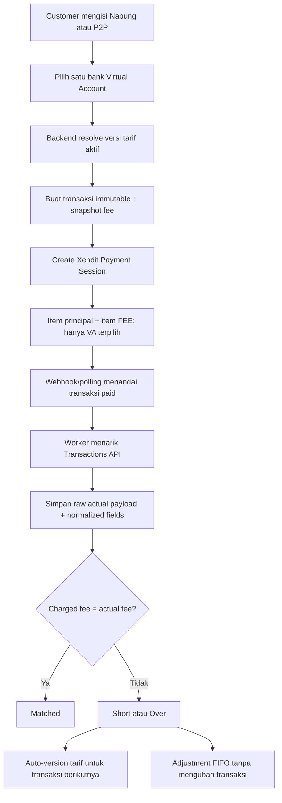

# Xendit VA Fee System — Changelog & AI Review Handoff

Tanggal implementasi: 2 Agustus 2026  
Status: implementasi selesai, migration konsisten, 172 test lulus

## Instruksi untuk AI reviewer

Lakukan **code review kritis**, bukan sekadar merangkum dokumen ini. Anggap klaim di dokumen ini sebagai intent yang harus diverifikasi terhadap source code.

1. Inspeksi implementasi aktual pada file yang tercantum di bagian **Review scope**.
2. Telusuri kedua alur end-to-end: **Nabung** dan **P2P/Proyek**.
3. Cari masalah data integrity, accounting, concurrency, security, authorization, idempotency, migration/backfill, state transition, dan ketidaksesuaian kontrak API Xendit.
4. Verifikasi bahwa nominal transaksi dan snapshot fee tidak dapat berubah setelah dibuat, kecuali field status/provider yang memang operasional.
5. Verifikasi rumus variance dan arah adjustment dengan contoh positif maupun negatif.
6. Verifikasi bahwa satu adjustment dapat dialokasikan ke banyak variance dan kekurangan yang belum tertutup tetap terlihat.
7. Verifikasi bahwa perubahan tarif otomatis hanya memengaruhi transaksi berikutnya.
8. Jalankan test dan tambahkan test eksploit/edge case bila ada invariant yang belum terbukti.
9. Jangan mengubah kode terlebih dahulu. Keluarkan findings dengan format:
   - severity `P0`–`P3`;
   - file dan baris;
   - skenario reproduksi;
   - dampak bisnis/akuntansi;
   - rekomendasi perbaikan paling kecil dan aman.
10. Jika tidak menemukan masalah, sebutkan area yang diperiksa, residual risk, dan hal yang masih membutuhkan verifikasi ke environment Xendit nyata.

Prompt singkat yang bisa diberikan bersama dokumen ini:

> Review implementasi Xendit VA fee dan reconciliation berdasarkan dokumen `docs/xendit-fee-system-ai-review.md`. Jangan percaya changelog tanpa memeriksa kode. Prioritaskan correctness dan financial data integrity di dua flow: Nabung dan P2P/Proyek. Laporkan hanya actionable findings P0–P3 dengan file/baris dan skenario reproduksi. Jangan implementasikan fix sebelum diminta.

## Tujuan bisnis

Sistem sebelumnya membebankan `service_fee` statis tanpa mengetahui biaya aktual per kanal Xendit. Perubahan ini bertujuan untuk:

- menerima **Virtual Account/bank transfer saja**;
- meminta customer memilih bank VA sebelum invoice dibuat;
- menghitung fee dari master tarif per kanal;
- memisahkan pokok dan fee sebagai item `FEE` pada payload Xendit;
- menyimpan snapshot tarif dan metadata Xendit secara lengkap;
- membandingkan fee yang dibebankan dengan actual fee Xendit;
- mempelajari perubahan fee untuk transaksi berikutnya;
- mencatat selisih dan adjustment tanpa memutasi transaksi awal;
- menerapkan perilaku yang sama pada rute Nabung dan P2P/Proyek.

## Keputusan utama

Xendit Payment Session tidak digunakan sebagai pre-payment fee quotation. Aplikasi menghitung invoice memakai versi tarif efektif terakhir di database. Actual fee baru ditarik setelah pembayaran melalui Transactions API.

Konsekuensinya:

- transaksi pertama setelah Xendit mengubah tarif mungkin memakai tarif lama;
- transaksi tersebut tetap immutable dan mencatat variance;
- actual fee yang teramati dapat membuat versi tarif baru untuk transaksi selanjutnya;
- historical variance diselesaikan melalui adjustment ledger, bukan dengan mengedit transaksi.

Referensi kontrak API:

- [Create Payment Session](https://docs.xendit.co/apidocs/create-session)
- [List Transactions](https://docs.xendit.co/apidocs/list-transactions)
- [Get Transaction](https://docs.xendit.co/apidocs/get-transaction)
- [Available Payment Channels](https://docs.xendit.co/v1/docs/available-payment-channels)

## Alur sistem



## Changelog fungsional

### 1. Pemilihan kanal VA

- Selector bank VA ditambahkan ke ringkasan checkout Nabung dan P2P.
- Fee quote ditarik dari endpoint server-side; nilai dari browser tidak dipercaya ketika transaksi dibuat.
- Form wajib mengirim satu kanal aktif untuk rute terkait.
- Payment Session menerima tepat satu nilai `allowed_payment_channels`.
- Kanal dapat dimatikan secara global atau per rute melalui boolean:
  - `is_enabled`;
  - `enabled_for_saving`;
  - `enabled_for_p2p`.

### 2. Versioned Xendit fee

- Tarif menyimpan fixed fee, percentage fee, VAT, currency, effective period, source, dan status.
- Periode tarif aktif untuk kanal/currency yang sama tidak boleh overlap.
- Definisi rate yang sudah dipakai transaksi tidak boleh diedit. Perubahan dibuat sebagai versi baru.
- Auto-observed rate diaktifkan bila delta masih di bawah/equal guardrail `fee_auto_update_max_delta`.
- Delta di atas guardrail menjadi `candidate` dan membutuhkan review manual.

### 3. Invoice breakdown dan metadata

Payload Xendit berisi:

- satu item principal bertipe `DIGITAL_SERVICE`;
- satu item fee bertipe `FEE` bila fee lebih dari nol;
- total item wajib sama dengan `Payment Session amount`;
- metadata rute, referensi transaksi, rate version, selected VA, principal, charged fee, dan charged total;
- snapshot request dan response awal Payment Session.

Walaupun fee dikirim sebagai item terpisah, `amount` Xendit tetap merupakan `principal + fee`.

### 4. Actual fee reconciliation

- Worker existing `sync_unpaid_payments` sekarang juga menjalankan fee reconciliation.
- Command manual tersedia: `python manage.py sync_xendit_fees --limit 50`.
- Record hanya direkonsiliasi setelah transaksi lokal berstatus paid.
- Lookup menggunakan merchant `reference_id` dan hanya menerima transaction `PAYMENT` berstatus `SUCCESS`.
- Gross amount, currency, dan selected channel dibandingkan dengan snapshot lokal. Mismatch masuk status `review`.
- Raw response Transactions API disimpan lengkap.
- Field normalized mencakup transaction/product/payment request ID, reference, transaction status/type, business ID, channel, account identifier, currency, gross/net amount, cashflow, settlement, timestamps, fee, VAT, withholding taxes, dan product data.

Definisi yang dipakai untuk rekonsiliasi customer-facing gateway fee:

```text
actual_total_fee = xendit_fee + value_added_tax
raw_variance     = charged_fee_total - actual_total_fee
residual         = raw_variance + total_adjustment_allocations
```

`xendit_withholding_tax` dan `third_party_withholding_tax` disimpan untuk audit, tetapi tidak ditambahkan ke gateway fee customer.

### 5. Adjustment ledger

- Adjustment adalah record terpisah dan signed.
- Nilai positif menutup shortage (`raw_variance < 0`).
- Nilai negatif menutup overcharge (`raw_variance > 0`).
- Allocation dilakukan FIFO berdasarkan waktu reconciliation/creation.
- Satu adjustment dapat dialokasikan ke banyak transaksi.
- Bila adjustment kurang, residual transaksi terakhir tetap minus/plus dan terus muncul di report.
- Bila adjustment berlebih, sisanya tercatat sebagai unallocated amount.
- Posted adjustment dan allocation bersifat immutable; koreksi dilakukan dengan adjustment lawan/reversal.

Contoh:

```text
5 transaksi masing-masing charged Rp4.000, actual Rp5.000
raw variance masing-masing = -Rp1.000

Adjustment +Rp5.000
=> 5 allocation @ +Rp1.000
=> seluruh residual = Rp0

Adjustment hanya +Rp3.500
=> tiga transaksi klop, transaksi keempat residual -Rp500,
   transaksi kelima residual -Rp1.000
```

### 6. Immutability

Field identitas, customer, produk/proyek, quantity, principal, service fee, total, dan currency pada transaksi Nabung/P2P tidak dapat diubah melalui model `save()` setelah insert.

Yang tetap mutable untuk operasi normal:

- status pembayaran;
- Xendit session/payment IDs dan status;
- payment link dan expiry;
- webhook/polling payload;
- provider timestamps;
- paid timestamp;
- delivery status email.

Snapshot fee terkunci setelah `xendit_session_id` terisi. Rate definition dan channel identity juga terkunci setelah dipakai transaksi.

Boundary yang harus dinilai reviewer: proteksi ini berada pada model layer. `QuerySet.update()`, raw SQL, atau akses langsung database dapat melewati override `save()`; belum ada PostgreSQL trigger untuk financial immutability.

### 7. Admin dan report

Menu Wagtail baru:

- **Xendit Fee**
  - Kanal VA;
  - Versi Tarif VA.
- **Rekonsiliasi Xendit**
  - filter tanggal, rute, channel, dan status;
  - charged fee, actual fee, adjustment, residual;
  - raw request/session/transaction metadata;
  - post adjustment FIFO;
  - recent adjustments dan unallocated value;
  - export CSV.

## Database changes

Tabel baru:

| Tabel | Fungsi |
|---|---|
| `xendit_payment_channels` | Master kanal VA dan boolean per rute |
| `xendit_fee_rates` | Versi tarif effective-dated per kanal |
| `xendit_fees` | Snapshot charged fee dan actual fee per transaksi |
| `xendit_fee_adjustments` | Header adjustment/reversal |
| `xendit_fee_adjustment_allocations` | Allocation signed adjustment ke transaksi |
| `xendit_reconciliation_runs` | Audit setiap worker reconciliation run |

Migration:

- `_payment/migrations/0001_initial.py`
- `_payment/migrations/0002_seed_va_channels_and_backfill.py`
- `_setting/migrations/0011_xenditsetting_auto_learn_va_fees_and_more.py`
- `_setting/migrations/0012_alter_xenditsetting_saving_payment_gateway_fee.py`

Seed awal mengaktifkan BCA, BNI, BRI, Mandiri, Permata, BSI, dan CIMB VA untuk kedua rute. Tarif awal memakai nilai legacy `saving_payment_gateway_fee`, dengan fallback Rp2.750.

Transaksi historis dibackfill menggunakan kanal nonaktif `LEGACY_UNKNOWN_VIRTUAL_ACCOUNT` karena checkout lama tidak menyimpan selected channel. Snapshot historical diberi marker `channel_unknown: true`; data tersebut tidak boleh dianggap sebagai BCA atau bank lain.

## Review scope

### Payment domain

- `_payment/models.py`
- `_payment/forms.py`
- `_payment/views.py`
- `_payment/urls.py`
- `_payment/services/pricing.py`
- `_payment/services/reconciliation.py`
- `_payment/services/adjustments.py`
- `_payment/admin_views.py`
- `_payment/wagtail_hooks.py`
- `_payment/templates/_payment/admin/fee_reconciliation_report.html`
- `_payment/management/commands/sync_xendit_fees.py`
- `_payment/migrations/0001_initial.py`
- `_payment/migrations/0002_seed_va_channels_and_backfill.py`
- `_payment/tests/test_payment_fees.py`

### Nabung integration

- `_product/forms/saving.py`
- `_product/forms/admin.py`
- `_product/models/saving_transaction.py`
- `_product/services/saving_workflow.py`
- `_product/views/saving.py`
- `_product/management/commands/sync_unpaid_payments.py`
- `cms/templates/cms/pages/saving_form.html`

### P2P/Proyek integration

- `_p2p/forms/purchase.py`
- `_p2p/models/purchase.py`
- `_p2p/models/project.py`
- `_p2p/services/pricing.py`
- `_p2p/services/purchase_workflow.py`
- `_p2p/views/pages.py`
- `cms/templates/cms/section/p2p_purchase_content.html`
- `cms/templates/cms/section/p2p_booking_complete_content.html`

### Xendit client dan configuration

- `backend/services/xendit.py`
- `backend/settings/base.py`
- `backend/urls.py`
- `_setting/models/xendit.py`
- `README.md`

Repository memiliki perubahan lain yang tidak berkaitan langsung dengan payment fee, seperti contact/address, navigation, SEO, dan styling. Reviewer sebaiknya membatasi findings payment pada scope di atas kecuali perubahan lain terbukti memengaruhi flow ini.

## Invariant yang wajib dibuktikan reviewer

- [ ] Disabled channel tidak bisa dipakai walaupun value POST dimanipulasi.
- [ ] Channel Nabung tidak otomatis boleh dipakai P2P, dan sebaliknya.
- [ ] Fee selalu dihitung ulang server-side pada waktu transaksi dibuat.
- [ ] Fee snapshot menunjuk rate dan channel yang benar pada waktu checkout.
- [ ] Payment Session hanya menerima selected VA, bukan semua payment method.
- [ ] Jumlah item principal + `FEE` selalu sama dengan total invoice.
- [ ] Adjustment tidak pernah mengubah `amount`, `subtotal`, `service_fee`, atau `total_amount` transaksi.
- [ ] Paid transaction tidak dapat direkonsiliasi dengan Xendit transaction yang reference, currency, amount, atau channel-nya berbeda.
- [ ] Fee berstatus `PENDING` belum dianggap final dan belum mengubah rate.
- [ ] Fee berstatus `CANCELED`/`REVERSED` masuk review.
- [ ] Auto-learn tidak membuat duplicate candidate rate tanpa batas.
- [ ] Auto-learn tidak menimpa historical transaction.
- [ ] Rate yang sudah dipakai tidak bisa diubah diam-diam.
- [ ] Allocation adjustment tidak melebihi residual target atau nominal adjustment.
- [ ] Concurrent adjustment posting tidak double-allocate variance yang sama.
- [ ] Repeated webhook, polling, dan reconciliation tetap idempotent.
- [ ] Historical backfill tidak mengklaim bank yang tidak diketahui.
- [ ] Admin report dan CSV menerapkan permission yang tepat.
- [ ] Metadata/raw payload tidak membocorkan credential atau data yang tidak layak ditampilkan ke role admin terkait.

## Edge case yang disarankan untuk diuji

1. Channel dimatikan setelah form dirender tetapi sebelum submit.
2. Rate berubah di antara fee quote browser dan POST checkout.
3. Xendit timeout setelah session sebenarnya berhasil dibuat.
4. Transactions API mengembalikan beberapa successful payments untuk reference yang sama.
5. Actual fee masih `PENDING`, kemudian berubah menjadi `COMPLETED`.
6. Transaction response tidak mempunyai `fee`, `net_amount`, atau `product_data`.
7. Actual channel code berupa `BCA` sementara configured code `BCA_VIRTUAL_ACCOUNT`.
8. Actual fee berubah drastis melewati guardrail.
9. Dua worker reconciliation berjalan bersamaan.
10. Dua admin mem-post adjustment pada waktu bersamaan.
11. Adjustment positif lebih besar dari total shortage tersedia.
12. Adjustment negatif untuk overcharge.
13. Reconciliation ulang setelah transaksi telah memperoleh allocation.
14. Admin mencoba mengubah transaction/rate/snapshot menggunakan normal form, `QuerySet.update()`, dan raw SQL.
15. Migration dijalankan pada database yang sudah memiliki transaksi historis dalam semua status.

## Verification yang sudah dilakukan

```bash
DJANGO_SETTINGS_MODULE=backend.settings.test python manage.py check
DJANGO_SETTINGS_MODULE=backend.settings.test python manage.py makemigrations --check --dry-run
DJANGO_SETTINGS_MODULE=backend.settings.test python manage.py test --verbosity 1
```

Hasil terakhir:

- 172 test dijalankan;
- 172 test lulus;
- tidak ada migration drift;
- Python compile check lulus;
- JavaScript syntax check untuk kedua checkout lulus;
- admin reconciliation page berhasil dirender dalam test;
- warning yang tersisa adalah warning compatibility Treebeard/Wagtail yang sudah ada dan bukan error fitur ini.

Test khusus membuktikan:

- selector VA dan fee quote;
- P2P mengabaikan `project.service_fee` legacy dan memakai central rate;
- principal dan `FEE` terpisah di payload kedua flow;
- selected VA menjadi satu-satunya allowed channel;
- immutable transaction dan fee snapshot;
- actual fee raw snapshot;
- auto-version rate setelah perubahan fee;
- withholding tax tidak ikut dihitung sebagai gateway fee;
- satu adjustment Rp5.000 menutup lima variance Rp1.000;
- adjustment yang kurang meninggalkan residual;
- total transaksi tidak berubah setelah adjustment;
- report admin dapat diakses.

## Deployment checklist

- [ ] Backup database sebelum migration.
- [ ] Jalankan `python manage.py migrate`.
- [ ] Pastikan API key Xendit memiliki permission **Transaction Read**.
- [ ] Review kanal hasil seed dan matikan bank yang belum diaktifkan pada merchant Xendit.
- [ ] Review tarif awal Rp2.750/legacy untuk setiap channel sebelum menerima transaksi production.
- [ ] Pastikan worker `payment-sync` tetap berjalan setiap 60 detik.
- [ ] Pantau reconciliation run, missing transaction, review status, dan candidate rate setelah deployment.
- [ ] Cocokkan beberapa transaksi production pertama dengan Xendit Transactions Report secara manual.
- [ ] Tetapkan role/permission admin yang boleh melihat metadata dan mem-post adjustment.

## Known limitations / residual risks

- Tidak ada pre-payment live fee quote dari Xendit; invoice memakai effective rate terakhir yang diketahui.
- Auto-learning menganggap VA fee dapat direpresentasikan sebagai fixed fee + VAT. Percentage/tiered contract harus dikonfigurasi manual dan direview.
- Immutability utama berada pada Django model layer, belum diperkuat database trigger.
- Test Transactions API menggunakan mocked provider response; reconciliation production tetap perlu smoke test dengan API key dan merchant Xendit nyata.
- Seed mengaktifkan tujuh VA secara default, tetapi availability sebenarnya bergantung pada aktivasi merchant Xendit.
- Unallocated adjustment dicatat dan ditampilkan, tetapi tidak otomatis dialokasikan ke variance yang baru muncul setelah adjustment tersebut diposting.

## Expected review output

```markdown
## Findings

### [P1] Judul singkat
- File: `path/to/file.py:123`
- Skenario: ...
- Dampak: ...
- Bukti: ...
- Rekomendasi: ...

## Areas reviewed
- Data model and migrations
- Nabung checkout
- P2P checkout
- Xendit API payloads
- Reconciliation and auto-rate learning
- Adjustment allocation
- Permissions and report
- Tests

## Residual risk / external verification
- ...
```
